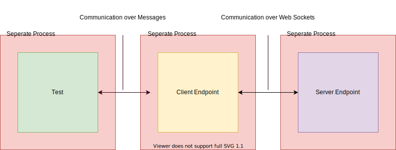

# How to test a Web Socket API

For a job at a Berlin FinTech-Startup I got the coding challenge to write a rudimentary test automation framework which puts the company's deployed web socket endpoint under test from the client perspective. For this coding challenge I had three days.

In addition to the fact, that I am not a Test Automation / QA Engineer, I also encountered the challenges while testing a publicly reachable web socket API. In this short article I would like to share my approach to solution, because I have not found any helpful information and / or tools on the web.

## The problem while testing a Web Socket API

While testing of the stateless HTTP request/response based API is not a rocket science, testing a web socket based one could be problematic. Especially when the connection is kept and you want to monitor and validate the permanent sent messages from the server to client.

When I test a REST API, I send a request to the endpoint, **wait** for the response and check the response code, the data (with format) and the response time. The test either passes or fails, the job is done and the other tests will run.

In contrast, testing a Web Socket API is different, because of the persistent nature of the connections. The test need a method to maintain the open connection and a way to see the messages that are permanent arrive in response to the client's message(s). Trying to test this in the way we test REST APIs, will block the single-threaded test case until it fails and therefore prevent the other test cases to be run.

## My Approach to Solution

While working on the coding challenge I came across the problem described above and finally came up with an acceptable solution for me:




The task was to test the communication to the server endpoint from the client perspective. That's how the framework does:

1. Each test is a single process with its own process id (PID) and message box. It starts the client endpoint in order to simulate the client perspective, which as well is a single process, and remembers the client's PID. The server didn't need to be started, because is already online and reachable over its web socket.
2. After that, the test is able to send messages to the client process.
3. The client forwards such incoming messages from the test to the server endpoint over the web socket connection.
4. The server sends a response to the client.
5. The client passes these responses to the test that started it.
6. Finally, the test validate the received response against the expected one.

*The *decision* to make the client endpoint and the tests as well as single (and possible distributed) processes came from the idea to make a "long living" test case that receives push messages that have to be monitored and validated. Such test case could be deployed with the help of the framework to its own node within a cluster and test the server. The test fails when its process terminates, because of a failing assertion and/or pattern matching.*

### Java Implementation

The implementation is in Java and with the help of the Akka framework in order to make the client endpoint and the tests as single processes that can communicate over messages rather than callback functions within the same thread. Therefore, the processes are called Actors. 

In practices, I would implement this test automation framework in the programming language **Erlang or Elixir and with the OTP framework**. But because of the short time I had for the coding challenge, I used tools that I am familiar with. But in my point of view an Erlang virtual machine based language is better suited to build such a framework.

#### Some code fragments

At the end of the day the framework core code consists only of two classes:

1. WebSocketClientEndpoint
2. WebSocketClientActor

##### Client

The WebSocketClientEndpoint is just a class managing the web socket connection between the server endpoint. It receives messages from the server endpoint and allows to setting a message handler.

```java
/** This class represents the client side endpoint of a web socket session.*/
@ClientEndpoint
public class WebSocketClientEndpoint {
    /** The session between the current client endpoint and the server endpoint. */
    private final Session session;
    /** A message handler to handle incoming messages. */
    private MessageHandler.Whole<String> messageHandler;

    /** Creates the client side endpoint and establish a session with the server's web 		 *  socket addressed by the given URI.
     *
     *  @param serverEndpointURI The URI of the server's endpoint to establish a session 	  *							  via web sockets.
     */
    public WebSocketClientEndpoint(URI serverEndpointURI) throws IOException, 																			 DeploymentException {
        this.session = 
            ClientManager.createClient().connectToServer(this, serverEndpointURI);
    }

    /** The onMessage method annotated with @OnMessage is called each time a message is 	 *  received from server.
     *
     * @param message The message received from server.
     * @param session The current session between the current client endpoint and the 		 *				  server endpoint.
     */
    @OnMessage
    public void onMessage(String message, Session session) {
        if (this.messageHandler != null)
            this.messageHandler.onMessage(message);
    }

    /** Sends the given message to the server endpoint.
     *
     * @param message The message to be send to the server endpoint.
     */
    public void sendMessage(String message) throws IOException {
            this.session.getBasicRemote().sendText(message);
    }

    /** Sets the message handler.
     *
     * @param handler The message handler to handle incoming messages.
     */
    public void setOnMessageHandler(MessageHandler.Whole<String> handler) {
        this.messageHandler = handler;
    }
}
```

The WebSocketClientActor is more interesting:

```java
/** This class represents a web socket client and is implemented as an actor to run
 *  as a separated process with its own message box.
 */
public class WebSocketClientActor extends UntypedAbstractActor {

    /** The web socket connection of the current client. */
    private final WebSocketClientEndpoint webSocketClientEndpoint;
    /** The reference of the sender actor.*/
    private ActorRef senderRef;

    /** Creates the web socket client as an actor.*/
    public WebSocketClientActor() throws URISyntaxException, IOException, 														 DeploymentException {
        this.webSocketClientEndpoint =
                new WebSocketClientEndpoint( new URI( getWebSocketURI() ) );
        
        this.webSocketClientEndpoint.setOnMessageHandler(
            message -> this.senderRef.tell( message, getSelf() )
        );
    }

    /** Is called when a messages is received from another actor.
     *
     * @param message The received message.
     */
    @Override
    public void onReceive(Object message) throws IOException {
        this.senderRef = getSender();
        this.webSocketClientEndpoint.sendMessage( (String) message );
    }

    /** Returns the URI of the server's web socket from the config.properties file.
     *  The key within the config.properties file should be 'web_socket_uri'.
     *  @return The URI of the server's web socket from the config.properties file.
     */
    private static String getWebSocketURI() {
        return ResourceBundle.getBundle("config").getString("web_socket_uri");
    }
}
```

This class represents a client which runs as its own process (actor) and receives via the onReceive Method messages from another actors (within the framework only from tests) and sends to the web socket server endpoint. Within the onReceive method it also saves the reference (PID) of the message sender (a test).

Besides this, the class registers an on message handler (handler for incoming socket messages) within the constructor. The handler forwards incoming messages from the server web socket endpoint to the test, that beforehand sent the request data.

##### Test

The minimal setup of a test case with this framework consists of three parts:

1. Create an actor under test. This is always the client.
2. Make the stimulation by sending a message such as echo "Hello World" to the client actor.
3. And create an actor to receiving and check the replies. This is always the test case itself.

The TestKit class provided by the Akka framework contains a collection of tools which makes this three steps easy to write:

```java
public class BaseTest {

    private static ActorSystem actorSystem;

    @BeforeClass
    public static void setUp() {
        actorSystem = ActorSystem.create("web_socket_test_automation_system");
    }

    @AfterClass
    public static void tearDown() {
        actorSystem.terminate();
        actorSystem = null;
    }

    @Test
    public void echoTest() {
        new TestKit(actorSystem) {
            {
                final ActorRef clientReference = 
                    actorSystem.actorOf( Props.create(WebSocketClientActor.class) );
                final String msg = "Hello Server";
                // Stimulation: Send echo to server's web socket
                clientReference.tell(msg, getRef() );
                // Tests {
                // The expected message should be equal to msg
                expectMsg(Duration.ofSeconds(2), msg);
                // No more messages are expected.
                expectNoMessage();
                // }
            }
        };
    }
}
```

getRef() is the method of the TestKit class which returns its PID. So the client can send messages to this test case.

## Run the tests

This test automation framework is based on maven. In order to run tests just type the following command:

``mvn test``

within the project's root directory.

## Finally

Writing and reading such tests looks pretty complicated. This is due to the fact that Java is not a concurrent and distributed language by nature and that this framework does not use a DDD. This is only a MVP for the coding challenge. The final product should be - as mentioned above - be implemented in a language such as Erlang or Elixir and offer DDD, implement the Fluent Design Pattern and more. Because I had a lot of fun doing this challenge, I will create in my free time an professional open source framework for testing web socket API using an Erlang virtual machine based programming language.

[Me at LinkedIn](https://www.linkedin.com/in/dawid-ł-8115141a2/)
